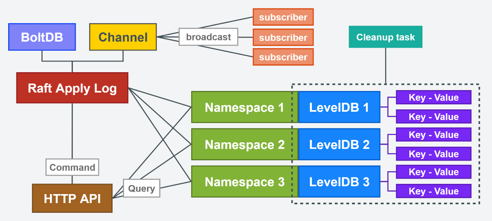

# FraiseDB
## 基于Hashicorp Raft + LevelDB的分布式键值型数据库

***

## 功能
* 键值写入/读取/范围查找
* 名称空间隔离数据
* 支持设置键值过期时间
* 节点间数据保持强一致性
* 直接通过HTTP接口操作数据
* WS订阅监听某个/某批前缀相同的键值更新事件

***

## 设计

### 节点上的数据读写流程
* 数据读取：直接访问指定名称空间的LevelDB
* 数据写入：先将数据写入到Raft集群的日志中，再通过日志消费将数据同步进LevelDB中
* 订阅发布服务-事件广播：节点从Raft日志中同步数据时，会顺带将数据投放到通道中，然后广播推送给目前连接到该节点的特定订阅者客户端
* 过期键值清理：对过期键值有两种处理方式，第一种是在查询时检测并删除，第二种是后台任务定时批量扫描删除



### 集群上的数据读写流程
* 数据读取：可在任意节点进行
* 数据写入：只能在领导者节点进行，如果在非领导者节点执行写入操作，会自动将该请求转发至当前集群的领导者节点执行


***

## 使用方式
* `1` 启动集群中的第一个节点时（或者单节点部署时），配置文件config.yaml中的node.first设为true，第一个节点默认为领导者节点
* `2` 启动集群中的第二、第三...乃至后续节点时，配置文件config.yaml中的node.first设为false
* `3` 在主节点（第一个启动的节点）上调用`新建节点`接口，将后续启动的节点依此加入到第一个节点所在的集群中
#### `注` 程序入口：main.go，配置文件：config.yaml

***

## 打包方式
```
go build main.go
```

***

## HTTP接口文档

***

### node 集群节点相关

***

> `POST` http://127.0.0.1:8000/v2/node 新建节点（必须在领导者节点上执行）
#### 请求
Body
```json
{
  "addr": "127.0.0.1",
  "httpPort": 7000,
  "tcpPort": 6999
}
```
httpPort：节点的http端口号，集群外部对节点的操作都通过http接口进行；tcpPort：节点的tcp端口号，供内部Raft集群调度使用

#### 成功响应
```json
{
  "code": 1000,
  "data": "127.0.0.1:7000"
}
```
data：节点的外部操作地址（http地址）

***

> `DELETE` http://127.0.0.1:8000/v2/node/{endpoint} 删除节点（必须在领导者节点上执行）
#### 请求
URI
```
endpoint = 127.0.0.1:7000
```
endpoint：节点的外部操作地址（http地址）

#### 成功响应
```json
{
  "code": 1000
}
``` 

***

> `GET` http://127.0.0.1:8000/v2/nodes 获取节点列表
#### 成功响应
```json
{
  "code": 1000,
  "data": [
    {
      "endpoint": "127.0.0.1:8000",
      "health": true,
      "leader": true
    },
    {
      "endpoint": "127.0.0.1:7000",
      "health": true,
      "leader": false
    }
  ]
}
```
health：是否健康；leader：是否是领导者节点

***

> `GET` http://127.0.0.1:8000/v2/leader 获取领导者节点
#### 成功响应
```json
{
  "code": 1000,
  "data": "127.0.0.1:8000"
}
```

***

> `GET` http://127.0.0.1:8000/v2/config 获取当前节点配置（内部调用）
#### 成功响应
```json
{
  "node": {
    "first": true,
    "addr": "127.0.0.1",
    "tcpPort": 7999,
    "httpPort": 8000
  },
  "store": {
    "data": "./data",
    "log": "./log"
  }
}
```

***

> `GET` http://127.0.0.1:8000/v2/health 获取当前节点健康状态（内部调用）
#### 成功响应
```
1
```

***

### namespace 名称空间相关

***

> `POST` http://127.0.0.1:8000/v2/namespace/{namespace} 新建名称空间
#### 请求
URI
```
namespace = dev
```
#### 成功响应
```json
{
  "code": 1000
}
``` 
namespace：名称空间

***

> `DELETE` http://127.0.0.1:8000/v2/namespace/{namespace} 删除名称空间
#### 请求
URI
```
namespace = dev
```
#### 成功响应
```json
{
  "code": 1000
}
``` 

***

> `GET` http://127.0.0.1:8000/v2/namespaces 获取名称空间列表
#### 成功响应
```json
{
  "code": 1000,
  "data": [
    "default",
    "dev"
  ]
}
``` 
data：名称空间列表
### kv 键值相关

***

> `PUT` http://127.0.0.1:8000/v2/kv/{namespace}/{key} 更新键值
#### 请求
URI
```
namespace = dev
key = test
```
Body
```json
{
    "value": "hello world",
    "ttl": 300
}
```
key：键；value：值；ttl：有效时间（秒）（当ttl=0时，键值不会过期）
#### 成功响应
```json
{
  "code": 1000,
  "data": 1690475805
}
``` 
data：键值的过期日期（秒级时间戳）
***

> `DELETE` http://127.0.0.1:8000/v2/kv/{namespace}/{key} 删除键值
#### 请求
URI
```
namespace = dev
key = test
```
#### 成功响应
```json
{
  "code": 1000
}
``` 

***

> `GET` http://127.0.0.1:8000/v2/kv/{namespace}/{key} 根据键获取键值
#### 请求
URI
```
namespace = dev
key = test
```
#### 成功响应

```json
{
  "code": 1000,
  "data": {
    "key": "test",
    "value": "hello world",
    "ddl": 1690475805
  }
}
``` 
ddl：键值的过期日期（秒级时间戳）（ddl=0时表示该键值不会过期）
***

> `GET` http://127.0.0.1:8000/v2/kvs/{namespace}/{key_prefix}?offset=0&count=10 根据键前缀获取键值列表
#### 请求
URI
```
namespace = dev
key_prefix = te
```
Query
```
offset = 0
count = 10
```
#### 成功响应
```json
{
  "code": 1000,
  "data": [
    {
      "key": "test",
      "value": "hello world",
      "ddl": 1690475805
    },
    {
      "key": "test1",
      "value": "hi world",
      "ddl": 0
    }
  ]
}
```
key_prefix：键的前缀；offset：分页游标；count：分页大小（count=0时返回当前游标后的所有数据）
***

### subscribe 订阅监听相关

***

> `WS` ws://127.0.0.1:8000/subscribe/{namespace}/{key_prefix}/{client_id} 订阅监听某个/某批前缀相同的键值更新事件
#### 请求
URI
```
namespace = dev
key_prefix = te
clientId = 12he6fj48dhe36fu398rhf3hf392423g
```
#### 推送消息样式
```json
{
  "method": 1,
  "key": "test",
  "value": "hello world",
  "ddl": 1690475805
}
```
client_id：客户端id（自定义传入，必须唯一）；method：0-键值删除事件；1-键值写入事件
***

### HTTP接口失败响应格式
```json
{
  "code": 1002,
  "error": "len(namespace) == 0"
}
```
失败响应码
* 1001 接口入参异常响应码
* 1002 服务处理异常响应码
* 1003 集群调用异常响应码